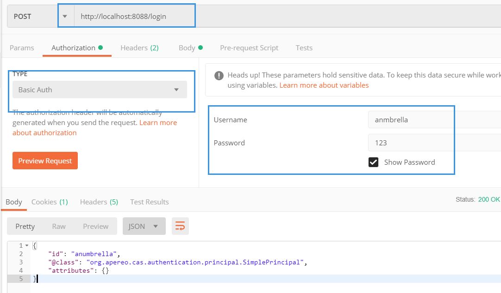

##说明
此版本cas-server使用oracle，使用自定义权限认证CustomAuthenticationConfiguration
未使用cas自带的方式，因为此数据库密码为  md5(用户名+密码+盐) 方式认证
默认方式只能对密码和盐进行操作，无法获取用户名

###doGetAuthenticationInfo 登录认证
客户端需要取消protected AuthenticationInfo doGetAuthenticationInfo(AuthenticationToken token)
方法，否则会走自己的方法，导致失败，可以直接调用父类方法
~~~

 /**
     * CAS认证 ,验证用户身份
     * 将用户基本信息设置到会话中
     */
    @Override
    protected AuthenticationInfo doGetAuthenticationInfo(AuthenticationToken token) {
        //调用CasRealm实现的认证方法,其包含验证ticket、填充CasToken的principal等操作)
        AuthenticationInfo authc = super.doGetAuthenticationInfo(token);
        String username = (String) authc.getPrincipals().getPrimaryPrincipal();
        SysUser user = userService.selectUserByLoginName(username);
        if (user != null) {
            //将用户信息放在session
            SecurityUtils.getSubject().getSession().setAttribute("user", user);
            return authc;
        } else {
            return null;
        }
    }
    
    //从seesion中获取用户信息
     public static SysUser getUser()
        {   
            SysUser user = (SysUser)getSubjct().getSession().getAttribute("user");      
            return user;
        }
~~~

仿照
https://blog.csdn.net/Anumbrella/article/details/81590595
代码：https://github.com/Shuyun123/CAS
第三章

其他参考文章
https://blog.csdn.net/yelllowcong/article/details/79236360

overlays使用
https://blog.csdn.net/qq_24874939/article/details/84534854

cas-server 5.3
https://blog.csdn.net/u011872945/article/details/81047025
https://blog.csdn.net/qq_36640713/article/details/82049506

##rest 参考文献
https://blog.csdn.net/Anumbrella/article/details/81149249
rest测试登陆接口(cas-server-rest-login)
